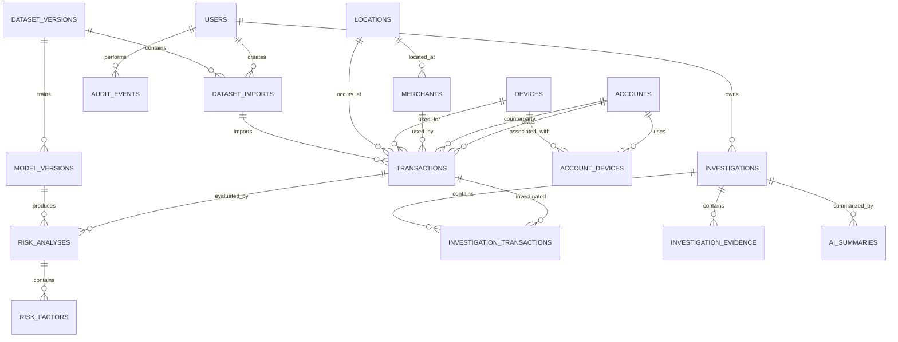

# DATABASE_DESIGN.md

# FinSignal — Database Design

## 1. Document Purpose

This document defines the relational database design for **FinSignal — Financial Transaction Intelligence & Investigation Platform**.

It translates the product, technical, and architectural requirements into a concrete PostgreSQL data model.

The design focuses on:

- financial transaction storage
- account and entity relationships
- transaction ingestion and lineage
- risk-analysis persistence
- investigation workflows
- evidence and AI-generated summaries
- model and dataset traceability
- auditability
- temporal correctness
- data integrity
- future extensibility without premature complexity

This document is intentionally focused on the **backend persistence model**. API contracts, ML methodology, and frontend structures are defined in their respective documents.

---

## 2. Database Goals

The database must provide:

1. Strong relational integrity.
2. Accurate monetary storage.
3. Clear separation between raw facts and derived intelligence.
4. Traceability from imported data to analytical results.
5. Support for historical and temporal analysis.
6. Support for human investigation workflows.
7. Reproducibility of model-generated results.
8. Efficient transaction and account-level querying.
9. Auditability of important user and system actions.
10. A clean migration path for future analytical and ML capabilities.

---

## 3. Database Technology

### 3.1 Primary Database

**PostgreSQL** is the selected relational database.

PostgreSQL is preferred because it provides:

- strong transactional guarantees
- mature indexing capabilities
- excellent support for temporal data
- `JSONB` for controlled semi-structured metadata
- strong constraint support
- window-function support
- analytical SQL capabilities
- extensibility for future vector or graph-adjacent workloads

The exact production PostgreSQL minor version will be pinned by the deployment environment.

---

## 4. Database Design Principles

### 4.1 Facts vs Intelligence

The database separates:

**Raw/operational facts**
- accounts
- merchants
- devices
- locations
- transactions
- dataset imports

from:

**Derived intelligence**
- risk analyses
- risk factors
- behavioral features
- investigation evidence
- AI summaries
- model metadata

A transaction must never be mutated merely because a model assigns it a different risk score.

---

### 4.2 Monetary Accuracy

Financial amounts must use:

```text
NUMERIC(18,2)
```

or another explicitly justified fixed-precision numeric type.

Floating-point types such as `REAL` and `DOUBLE PRECISION` must not be used for monetary amounts.

---

### 4.3 UTC Storage

All event timestamps use:

```text
TIMESTAMPTZ
```

and are stored/handled consistently in UTC.

Application-level presentation may convert timestamps to the user's preferred timezone.

---

### 4.4 Internal IDs

Primary keys use UUIDs.

This avoids predictable sequential identifiers being exposed through APIs and works well for distributed ingestion and future service extraction.

PostgreSQL UUID generation will use the database-supported UUID generation mechanism selected during implementation.

---

### 4.5 Naming Convention

Database naming uses:

- `snake_case`
- singular conceptual table names where practical
- explicit foreign-key names
- `created_at`
- `updated_at`
- `_id` suffix for foreign keys

Examples:

```text
risk_analyses
investigation_evidence
dataset_imports
account_id
model_version_id
```

---

## 5. Logical Data Model

The core relationship structure is:



---

# 6. Core Tables

## 6.1 `users`

Stores authenticated application users.

### Columns

| Column | Type | Null | Description |
|---|---|---:|---|
| `id` | UUID | No | Primary key |
| `email` | VARCHAR(255) | No | Login identifier |
| `password_hash` | VARCHAR(255) | No | Secure password hash |
| `role` | VARCHAR(32) | No | ADMIN, ANALYST, INVESTIGATOR |
| `is_active` | BOOLEAN | No | Account activation state |
| `created_at` | TIMESTAMPTZ | No | Creation timestamp |
| `updated_at` | TIMESTAMPTZ | No | Last modification timestamp |

### Constraints

- Primary key: `id`
- Unique: `email`
- `role` must be one of the supported application roles.
- Email comparison should be normalized consistently.

Passwords must never be stored in plaintext.

---

## 6.2 `accounts`

Represents financial accounts being analyzed.

The system intentionally avoids storing real card numbers, CVV values, passwords, or unnecessary personally identifiable information.

### Columns

| Column | Type | Null | Description |
|---|---|---:|---|
| `id` | UUID | No | Primary key |
| `external_account_id` | VARCHAR(128) | Yes | Source/dataset identifier |
| `account_type` | VARCHAR(32) | No | Account classification |
| `customer_age` | SMALLINT | Yes | Synthetic/customer age when available |
| `home_location_id` | UUID | Yes | FK to locations |
| `status` | VARCHAR(32) | No | Account status |
| `created_at` | TIMESTAMPTZ | No | Account creation timestamp |
| `updated_at` | TIMESTAMPTZ | No | Last modification timestamp |

### Notes

`account_age_days` is not persisted as a primary fact.

It can be derived from:

```text
transaction_timestamp - account.created_at
```

This avoids storing a value that can become stale.

---

## 6.3 `merchants`

Stores merchant information.

### Columns

| Column | Type | Null | Description |
|---|---|---:|---|
| `id` | UUID | No | Primary key |
| `external_merchant_id` | VARCHAR(128) | Yes | Source identifier |
| `merchant_name` | VARCHAR(255) | No | Display name |
| `merchant_category` | VARCHAR(64) | No | Merchant classification |
| `location_id` | UUID | Yes | Merchant location |
| `created_at` | TIMESTAMPTZ | No | Creation timestamp |
| `updated_at` | TIMESTAMPTZ | No | Last modification timestamp |

### Relationships

A merchant may appear in many transactions.

A merchant location is represented by `locations`.

---

## 6.4 `devices`

Represents devices used to initiate transactions.

### Columns

| Column | Type | Null | Description |
|---|---|---:|---|
| `id` | UUID | No | Primary key |
| `external_device_id` | VARCHAR(128) | Yes | Source identifier |
| `device_type` | VARCHAR(32) | Yes | Mobile, desktop, tablet, etc. |
| `operating_system` | VARCHAR(64) | Yes | OS information |
| `first_seen_at` | TIMESTAMPTZ | Yes | First known observation |
| `created_at` | TIMESTAMPTZ | No | Record creation timestamp |
| `updated_at` | TIMESTAMPTZ | No | Last modification timestamp |

A device is deliberately modeled independently from an account.

This permits future analysis of:

- shared devices
- account takeover
- device reuse
- device-account networks

---

## 6.5 `account_devices`

Many-to-many relationship between accounts and devices.

### Columns

| Column | Type | Null | Description |
|---|---|---:|---|
| `account_id` | UUID | No | FK to accounts |
| `device_id` | UUID | No | FK to devices |
| `first_seen_at` | TIMESTAMPTZ | No | First account-device observation |
| `last_seen_at` | TIMESTAMPTZ | Yes | Most recent observation |
| `is_primary` | BOOLEAN | No | Primary/normal device indicator |

### Constraints

Primary key:

```text
(account_id, device_id)
```

This relationship is important for detecting new-device behavior.

---

## 6.6 `locations`

Normalized geographic reference data.

### Columns

| Column | Type | Null | Description |
|---|---|---:|---|
| `id` | UUID | No | Primary key |
| `city` | VARCHAR(128) | No | City |
| `state` | VARCHAR(128) | Yes | State/region |
| `country` | VARCHAR(128) | No | Country |
| `latitude` | NUMERIC(9,6) | Yes | Optional latitude |
| `longitude` | NUMERIC(9,6) | Yes | Optional longitude |
| `created_at` | TIMESTAMPTZ | No | Creation timestamp |

Coordinates are optional because the MVP primarily requires logical location behavior rather than exact geospatial tracking.

---

# 7. Transaction Model

## 7.1 `transactions`

This is the central financial fact table.

A transaction represents an observed financial event associated with an account.

### Columns

| Column | Type | Null | Description |
|---|---|---:|---|
| `id` | UUID | No | Internal primary key |
| `external_transaction_id` | VARCHAR(128) | No | Source transaction identifier |
| `dataset_import_id` | UUID | Yes | Import lineage |
| `account_id` | UUID | No | Primary account associated with transaction |
| `counterparty_account_id` | UUID | Yes | Other account for account-to-account transfers |
| `merchant_id` | UUID | Yes | Merchant reference |
| `device_id` | UUID | Yes | Device used |
| `location_id` | UUID | Yes | Transaction location |
| `occurred_at` | TIMESTAMPTZ | No | Business event timestamp |
| `amount` | NUMERIC(18,2) | No | Transaction amount |
| `currency` | CHAR(3) | No | ISO-style currency code |
| `transaction_type` | VARCHAR(32) | No | Financial event type |
| `direction` | VARCHAR(16) | No | DEBIT or CREDIT |
| `category` | VARCHAR(64) | Yes | Transaction category |
| `payment_method` | VARCHAR(32) | Yes | Payment mechanism |
| `channel` | VARCHAR(32) | Yes | Transaction channel |
| `created_at` | TIMESTAMPTZ | No | Database insertion timestamp |

### Important Modeling Decision

The transaction table does **not** contain:

- risk score
- anomaly score
- fraud probability
- model prediction
- investigation status

Those are derived or workflow concepts and belong in separate tables.

This preserves the distinction between:

> What happened?

and:

> What does the system currently believe about what happened?

---

## 7.2 Transfer Representation

For an account-to-account transfer:

```text
transaction_type = TRANSFER
counterparty_account_id IS NOT NULL
```

`account_id` represents the primary account perspective.

`direction` identifies whether that account is the:

- sender/debit side
- receiver/credit side

The database should reject a transaction where:

```text
account_id = counterparty_account_id
```

Enforced via database table-level constraint:

```sql
CONSTRAINT chk_transfers_counterparty_distinct
    CHECK (counterparty_account_id IS NULL OR account_id != counterparty_account_id)
```

For MVP ingestion, each transfer record represents one analytical transaction perspective rather than automatically creating a second mirrored transaction.

This avoids accidental double counting.

---

## 7.3 Transaction Integrity and Idempotency Rules

Examples of database/application checks:

```text
amount > 0
currency has exactly three characters
direction IN ('DEBIT', 'CREDIT')
```

Additional conditional rules:

```text
TRANSFER -> counterparty_account_id IS NOT NULL
non-TRANSFER -> counterparty_account_id may be NULL
```

### Ingestion Idempotency & Deduplication

To prevent duplicate transaction ingestion under concurrent or re-tried requests:

1. **Batch Import Ingestion (`dataset_import_id IS NOT NULL`):**
   A partial unique index enforces uniqueness of the external transaction identifier within an import batch:
   ```sql
   CREATE UNIQUE INDEX uq_transactions_import_ext_id
       ON transactions (dataset_import_id, external_transaction_id)
       WHERE dataset_import_id IS NOT NULL;
   ```
2. **Standalone / Manual Ingestion (`dataset_import_id IS NULL`):**
   PostgreSQL treats `NULL` values as distinct in standard unique constraints. Standalone or directly injected transactions without an import batch rely on application-level idempotency checks (verifying `account_id`, `external_transaction_id`, and `occurred_at`) within an atomic transaction.

Merchant/device/location references remain nullable because not every transaction necessarily contains those attributes.

---

# 8. Dataset and Ingestion Lineage

## 8.1 `dataset_versions`

Represents a logical version of a dataset.

### Columns

| Column | Type | Null | Description |
|---|---|---:|---|
| `id` | UUID | No | Primary key |
| `version` | VARCHAR(64) | No | Dataset version identifier |
| `source_type` | VARCHAR(32) | No | SYNTHETIC or IMPORTED |
| `generator_version` | VARCHAR(64) | Yes | Generator version |
| `seed` | BIGINT | Yes | Reproducibility seed |
| `config` | JSONB | Yes | Generation/configuration metadata |
| `transaction_count` | INTEGER | Yes | Number of transactions |
| `fraud_rate` | NUMERIC(8,5) | Yes | Ground-truth fraud rate when known |
| `period_start` | TIMESTAMPTZ | Yes | Dataset time range |
| `period_end` | TIMESTAMPTZ | Yes | Dataset time range |
| `created_at` | TIMESTAMPTZ | No | Creation timestamp |

### Purpose

This table makes dataset lineage explicit.

A model can therefore be associated with the dataset version used for training/evaluation.

---

## 8.2 `dataset_imports`

Represents an actual ingestion attempt.

### Columns

| Column | Type | Null | Description |
|---|---|---:|---|
| `id` | UUID | No | Primary key |
| `dataset_version_id` | UUID | Yes | Dataset version |
| `initiated_by` | UUID | Yes | User who initiated import |
| `filename` | VARCHAR(255) | Yes | Uploaded filename |
| `source_type` | VARCHAR(32) | No | CSV, GENERATED, etc. |
| `status` | VARCHAR(32) | No | PENDING, PROCESSING, COMPLETED, FAILED |
| `total_rows` | INTEGER | No | Rows received |
| `valid_rows` | INTEGER | No | Valid rows |
| `invalid_rows` | INTEGER | No | Invalid rows |
| `started_at` | TIMESTAMPTZ | No | Processing start |
| `completed_at` | TIMESTAMPTZ | Yes | Processing completion |
| `created_at` | TIMESTAMPTZ | No | Record creation |

This table provides ingestion-level lineage and operational visibility.

---

## 8.3 `dataset_import_errors`

Stores validation failures without storing unnecessary sensitive raw data.

### Columns

| Column | Type | Null | Description |
|---|---|---:|---|
| `id` | UUID | No | Primary key |
| `dataset_import_id` | UUID | No | Import reference |
| `row_number` | INTEGER | Yes | Source row |
| `field_name` | VARCHAR(128) | Yes | Invalid field |
| `error_code` | VARCHAR(64) | No | Machine-readable error |
| `message` | TEXT | No | Human-readable description |
| `created_at` | TIMESTAMPTZ | No | Error timestamp |

Raw field values should not be persisted by default.

This avoids turning validation logs into an accidental sensitive-data store.

---

# 9. Risk Intelligence Model

## 9.1 `model_versions`

Stores metadata describing analytical/ML model versions.

### Columns

| Column | Type | Null | Description |
|---|---|---:|---|
| `id` | UUID | No | Primary key |
| `name` | VARCHAR(128) | No | Model family/name |
| `version` | VARCHAR(64) | No | Model version |
| `algorithm` | VARCHAR(128) | No | Algorithm used |
| `feature_version` | VARCHAR(64) | Yes | Feature definition version |
| `dataset_version_id` | UUID | Yes | Training/evaluation dataset |
| `parameters` | JSONB | Yes | Model configuration |
| `metrics` | JSONB | Yes | Evaluation metrics |
| `artifact_uri` | TEXT | Yes | Model artifact reference |
| `artifact_hash` | VARCHAR(64) | Yes | SHA-256 digest for artifact integrity |
| `status` | VARCHAR(32) | No | EXPERIMENTAL, VALIDATED, ACTIVE, RETIRED |
| `created_at` | TIMESTAMPTZ | No | Creation timestamp |

A model version is immutable after activation except for lifecycle metadata. Lifecycle transitions follow: `EXPERIMENTAL -> VALIDATED -> ACTIVE -> RETIRED`.

---

## 9.2 `risk_analyses`

Stores model/risk results for transactions.

### Columns

| Column | Type | Null | Description |
|---|---|---:|---|
| `id` | UUID | No | Primary key |
| `transaction_id` | UUID | No | Transaction evaluated |
| `model_version_id` | UUID | No | Model that produced result |
| `score` | NUMERIC(8,3) | No | Normalized risk score |
| `risk_level` | VARCHAR(16) | No | LOW, MEDIUM, HIGH, CRITICAL |
| `analysis_status` | VARCHAR(32) | No | COMPLETED or FAILED |
| `created_at` | TIMESTAMPTZ | No | Analysis timestamp |

### Constraints

Score range:

```text
0 <= score <= 100
```

Unique constraint:

```text
(transaction_id, model_version_id)
```

This permits re-analysis with a new model while preventing accidental duplicate results for the same model version.

---

## 9.3 `risk_factors`

Stores structured reasons supporting a risk analysis.

### Columns

| Column | Type | Null | Description |
|---|---|---:|---|
| `id` | UUID | No | Primary key |
| `risk_analysis_id` | UUID | No | Parent risk analysis |
| `factor_code` | VARCHAR(64) | No | Stable machine-readable code |
| `factor_label` | VARCHAR(255) | No | Human-readable factor |
| `severity` | VARCHAR(16) | No | INFO, LOW, MEDIUM, HIGH |
| `value_numeric` | NUMERIC(18,6) | Yes | Optional measured value |
| `value_text` | TEXT | Yes | Optional textual value |
| `evidence` | JSONB | Yes | Structured supporting metadata |
| `created_at` | TIMESTAMPTZ | No | Creation timestamp |

Examples:

```text
NEW_DEVICE
UNUSUAL_LOCATION
HIGH_VELOCITY
AMOUNT_ANOMALY
UNUSUAL_TIME
SPENDING_SHIFT
```

Risk factors are evidence-oriented and should be understandable by investigators.

---

# 10. Investigation Model

## 10.1 `investigations`

Represents a human investigation case.

### Columns

| Column | Type | Null | Description |
|---|---|---:|---|
| `id` | UUID | No | Primary key |
| `assigned_to` | UUID | Yes | Investigator/user |
| `status` | VARCHAR(32) | No | OPEN, UNDER_REVIEW, RESOLVED |
| `priority` | VARCHAR(16) | No | LOW, MEDIUM, HIGH, CRITICAL |
| `resolution` | VARCHAR(32) | Yes | Final resolution |
| `resolution_notes` | TEXT | Yes | Human explanation |
| `created_at` | TIMESTAMPTZ | No | Creation timestamp |
| `updated_at` | TIMESTAMPTZ | No | Last modification |

Resolutions:

```text
LEGITIMATE
SUSPICIOUS
CONFIRMED_FRAUD
INCONCLUSIVE
```

An investigation is a workflow object, not simply a copy of a risk analysis.

---

## 10.2 `investigation_transactions`

Allows an investigation to contain multiple related transactions.

### Columns

| Column | Type | Null | Description |
|---|---|---:|---|
| `investigation_id` | UUID | No | Investigation |
| `transaction_id` | UUID | No | Related transaction |
| `relationship_type` | VARCHAR(32) | No | PRIMARY or RELATED |
| `created_at` | TIMESTAMPTZ | No | Relationship creation |

### Constraints

Primary key:

```text
(investigation_id, transaction_id)
```

An investigation must have exactly one `PRIMARY` transaction at the application/domain level.

This structure allows investigators to move from:

```text
Flagged transaction
        ↓
Related transactions
        ↓
Account behavior
        ↓
Evidence
```

without redesigning the investigation model.

---

# 11. Evidence Model

## 11.1 `investigation_evidence`

Stores evidence assembled for an investigation.

### Columns

| Column | Type | Null | Description |
|---|---|---:|---|
| `id` | UUID | No | Primary key |
| `investigation_id` | UUID | No | Investigation |
| `evidence_type` | VARCHAR(64) | No | Evidence classification |
| `source_type` | VARCHAR(64) | Yes | Source entity |
| `source_id` | UUID | Yes | Source identifier |
| `title` | VARCHAR(255) | No | Evidence title |
| `description` | TEXT | Yes | Human-readable explanation |
| `payload` | JSONB | Yes | Structured evidence snapshot |
| `created_at` | TIMESTAMPTZ | No | Evidence creation time |

### Evidence Immutability Principle

Evidence records are strictly append-only and immutable after creation. The table deliberately omits an `updated_at` column; evidence cannot be updated, patched, or overwritten once attached to an investigation. If an investigator uncovers new information or revises an interpretation, a new evidence record is created.

Evidence should capture the relevant state used during investigation.

The system should not rely exclusively on re-querying mutable data when reproducing an investigation later.

The `payload` therefore acts as a structured evidence snapshot where appropriate.

### Polymorphic `source_id` Design Trade-Off

The `source_id` column is a polymorphic reference without a database-level foreign key constraint. Evidence can reference various source entity types:
- `transaction` (`transactions.id`)
- `risk_analysis` (`risk_analyses.id`)
- `risk_factor` (`risk_factors.id`)
- `account` (`accounts.id`)
- `device` (`devices.id`)
- `user_note` / `manual_observation` (null source_id)

Rather than introducing complex schema patterns (such as entity-attribute-value tables or multiple nullable foreign keys for every conceivable entity type), FinSignal deliberately enforces referential and business integrity at the application/domain layer:
1. `source_type` must be validated against an enumerated set of permitted domain entities.
2. The application verifies that `source_id` exists in the corresponding entity repository prior to persistence.
3. The referenced source entity must belong to the scope of the investigation's account or transactions.
4. Authorization rules verify the investigator has permission to view the referenced entity.

---

# 12. AI Investigation Model

## 12.1 `ai_summaries`

Stores AI-generated investigation summaries.

### Columns

| Column | Type | Null | Description |
|---|---|---:|---|
| `id` | UUID | No | Primary key |
| `investigation_id` | UUID | No | Investigation |
| `provider` | VARCHAR(64) | No | LLM provider |
| `model` | VARCHAR(128) | No | Model identifier |
| `prompt_version` | VARCHAR(64) | Yes | Prompt/template version |
| `evidence_hash` | VARCHAR(128) | Yes | Evidence-context fingerprint |
| `status` | VARCHAR(32) | No | PENDING, COMPLETED, FAILED |
| `summary` | TEXT | Yes | Generated summary |
| `error_message` | TEXT | Yes | Failure information |
| `generated_at` | TIMESTAMPTZ | No | Generation timestamp |

### Safety Boundary

AI output is informational.

It must not overwrite:

- transaction facts
- risk analysis results
- investigation evidence
- human resolution

The investigator remains responsible for the final case resolution.

---

# 13. Audit Model

## 13.1 `audit_events`

Records important user and system actions.

### Columns

| Column | Type | Null | Description |
|---|---|---:|---|
| `id` | UUID | No | Primary key |
| `actor_user_id` | UUID | Yes | User responsible |
| `action` | VARCHAR(128) | No | Action performed |
| `entity_type` | VARCHAR(64) | No | Affected entity |
| `entity_id` | UUID | Yes | Affected entity ID |
| `metadata` | JSONB | Yes | Structured event metadata |
| `created_at` | TIMESTAMPTZ | No | Event timestamp |

Examples:

```text
LOGIN
DATASET_IMPORTED
INVESTIGATION_CREATED
INVESTIGATION_ASSIGNED
EVIDENCE_ADDED
AI_SUMMARY_GENERATED
INVESTIGATION_RESOLVED
```

Audit records should be append-oriented.

They should not be casually updated or deleted through normal application workflows.

---

# 14. Relationships and Foreign Keys

The principal foreign keys are:

```text
accounts.home_location_id
    -> locations.id

account_devices.account_id
    -> accounts.id

account_devices.device_id
    -> devices.id

merchants.location_id
    -> locations.id

transactions.account_id
    -> accounts.id

transactions.counterparty_account_id
    -> accounts.id

transactions.merchant_id
    -> merchants.id

transactions.device_id
    -> devices.id

transactions.location_id
    -> locations.id

transactions.dataset_import_id
    -> dataset_imports.id

dataset_imports.dataset_version_id
    -> dataset_versions.id

dataset_imports.initiated_by
    -> users.id

risk_analyses.transaction_id
    -> transactions.id

risk_analyses.model_version_id
    -> model_versions.id

model_versions.dataset_version_id
    -> dataset_versions.id

risk_factors.risk_analysis_id
    -> risk_analyses.id

investigations.assigned_to
    -> users.id

investigation_transactions.investigation_id
    -> investigations.id

investigation_transactions.transaction_id
    -> transactions.id

investigation_evidence.investigation_id
    -> investigations.id

ai_summaries.investigation_id
    -> investigations.id

audit_events.actor_user_id
    -> users.id
```

Foreign-key behavior should generally favor:

```text
RESTRICT
```

for important historical entities.

Cascading deletes should be used sparingly because financial and investigative records are intentionally durable.

---

# 15. Indexing Strategy

Indexes must support actual application access patterns rather than being created indiscriminately.

## 15.1 Transaction Indexes

Recommended:

```text
transactions(account_id, occurred_at)
transactions(occurred_at)
transactions(merchant_id, occurred_at)
transactions(device_id, occurred_at)
transactions(location_id, occurred_at)
transactions(dataset_import_id)
```

These support:

- account history
- time-window analysis
- merchant analysis
- device analysis
- location analysis
- ingestion tracing

---

## 15.2 Risk Indexes

Recommended:

```text
risk_analyses(transaction_id)
risk_analyses(model_version_id, score)
risk_analyses(risk_level, created_at)
```

---

## 15.3 Investigation Indexes

Recommended:

```text
investigations(status, priority)
investigations(assigned_to, status)
investigation_transactions(transaction_id)
investigation_evidence(investigation_id, created_at)
```

---

## 15.4 Audit Indexes

Recommended:

```text
audit_events(actor_user_id, created_at)
audit_events(entity_type, entity_id, created_at)
audit_events(created_at)
```

---

# 16. Temporal Correctness

Temporal correctness is critical to FinSignal.

When evaluating transaction `T` at time `t`, derived behavioral features must only use information available at or before `t`.

The database therefore stores:

```text
transactions.occurred_at
```

as the business-event timestamp.

This is distinct from:

```text
created_at
```

which represents persistence time.

These timestamps must not be treated as interchangeable.

---

## 16.1 Example

If an account makes:

```text
10:00 transaction A
10:05 transaction B
10:10 transaction C
```

the features calculated for transaction B must not use information from transaction C.

This rule is enforced primarily by feature-engineering/application logic, but the database model preserves the timestamps required to make the rule possible.

---

# 17. Raw Data vs Derived Data

The database follows this conceptual separation:

```text
RAW / OPERATIONAL
-----------------
accounts
merchants
devices
locations
transactions
dataset_versions
dataset_imports


DERIVED INTELLIGENCE
--------------------
model_versions
risk_analyses
risk_factors


HUMAN INVESTIGATION
-------------------
investigations
investigation_transactions
investigation_evidence


AI OUTPUT
---------
ai_summaries


GOVERNANCE
----------
users
audit_events
dataset_import_errors
```

This separation makes data lineage easier to reason about.

---

# 18. Data Retention and Deletion

The MVP does not implement automatic destructive retention policies.

Financial transaction history, risk analyses, investigation records, and audit records should be treated as durable records.

If deletion is required later, the system should distinguish:

- operational deletion
- archival
- anonymization
- legal/compliance retention

No blanket cascade-delete strategy should be introduced without considering auditability.

---

# 19. Data Integrity Constraints

Important constraints include:

### Users

```text
email IS UNIQUE
role is valid
```

### Accounts

```text
status is valid
customer_age is within reasonable range when present
```

### Transactions

```text
amount > 0
currency is valid
direction is valid
account_id != counterparty_account_id
TRANSFER requires counterparty_account_id
```

### Risk Analysis

```text
0 <= score <= 100
(transaction_id, model_version_id) is unique
```

### Investigations

```text
status is valid
priority is valid
resolution is valid when status = RESOLVED
```

The application layer remains responsible for complex cross-record business rules.

---

# 20. JSONB Usage Rules

PostgreSQL `JSONB` is intentionally limited to information that is genuinely semi-structured.

Good candidates:

```text
dataset_versions.config
model_versions.parameters
model_versions.metrics
risk_factors.evidence
investigation_evidence.payload
ai_summaries metadata if later required
audit_events.metadata
```

Core relational attributes must not be moved into JSON merely for convenience.

For example:

```text
transaction.amount
transaction.account_id
transaction.occurred_at
```

must remain first-class columns.

---

# 21. Ground Truth and Fraud Labels

Synthetic ground truth is required for ML evaluation but must be handled carefully.

Potential dataset-level fields include:

```text
is_fraud
fraud_scenario
scenario_instance_id
```

These values may exist in the dataset-generation/import pipeline.

However:

**They must not be used as model inference features.**

Production analytical tables should not expose ground-truth fraud labels to the risk-scoring path.

Ground truth belongs to evaluation/training workflows and must be isolated from inference features to prevent leakage.

---

# 22. Feature Storage Decision

The MVP does **not** persist every calculated behavioral feature as a permanent transaction column.

Examples such as:

```text
amount_zscore
transactions_last_1_hour
merchant_frequency
is_new_device
is_unusual_hour
spending_deviation
```

are derived features.

Initially they should be generated through the feature-engineering layer.

A persistent feature store may be introduced later if:

- computation becomes expensive
- reproducibility requires persisted feature snapshots
- model serving requires low-latency features
- multiple models share the same feature definitions

This prevents premature feature-store complexity.

---

# 23. Model and Dataset Lineage

The intended lineage is:

```text
Dataset Version
      |
      v
Model Version
      |
      v
Risk Analysis
      |
      v
Risk Factors
      |
      v
Investigation
      |
      v
Evidence
      |
      v
AI Summary
      |
      v
Human Resolution
```

This allows an investigator or developer to determine:

- which transaction was evaluated
- which model evaluated it
- which model version was used
- which dataset was associated with the model
- which factors supported the result
- what evidence was assembled
- what AI summary was generated
- what the human ultimately decided

---

# 24. Concurrency Considerations

The database must support safe concurrent investigator workflows.

Examples:

- two investigators opening the same case
- an investigator resolving a case while another edits it
- ingestion and risk analysis operating concurrently
- multiple risk analyses being created

At the application layer, investigation updates should use optimistic concurrency where appropriate.

Possible implementation:

```text
updated_at
```

or a dedicated:

```text
version
```

column.

The exact mechanism will be finalized during implementation.

---

# 25. Transaction Boundaries

Operations involving multiple records should use database transactions.

Examples:

### Risk Analysis

```text
create risk_analysis
create risk_factors
commit
```

### Investigation Creation

```text
create investigation
create primary investigation_transaction
commit
```

### Evidence Assembly

```text
create evidence records
commit
```

### Investigation Resolution

```text
update investigation
create audit event
commit
```

The application must avoid partially persisted investigation state.

---

# 26. Migration Strategy

Database schema changes will be managed through versioned migrations.

Recommended structure:

```text
V1__create_users.sql
V2__create_reference_entities.sql
V3__create_transactions.sql
V4__create_dataset_lineage.sql
V5__create_risk_tables.sql
V6__create_investigation_tables.sql
V7__create_ai_tables.sql
V8__create_audit_tables.sql
V9__add_indexes_and_constraints.sql
```

The exact migration grouping may differ during implementation.

Migrations must be:

- deterministic
- versioned
- reviewable
- forward-applicable
- tested against a clean database

---

# 27. Seed Data

Development environments may include deterministic seed data.

Seed data should be clearly separated from generated datasets.

Example:

```text
development users
sample accounts
sample merchants
sample devices
sample locations
```

Production environments must not rely on development seed scripts.

---

# 28. Backup and Recovery

Production deployment should eventually provide:

- automated PostgreSQL backups
- point-in-time recovery where supported
- restore testing
- backup retention policy
- migration compatibility checks

For the MVP local-development environment, Docker volume persistence is sufficient.

Backup infrastructure is not considered part of the initial application implementation.

---

# 29. Security Considerations

The database must be treated as sensitive even though the initial dataset is synthetic.

Rules:

1. Never store plaintext passwords.
2. Do not store card numbers or CVV.
3. Avoid unnecessary personally identifiable information.
4. Do not log credentials.
5. Do not place secrets in JSONB metadata.
6. Restrict database credentials through environment variables.
7. Use least-privilege database users where practical.
8. Avoid exposing internal database IDs unnecessarily through logs.
9. Prevent unauthorized direct database access.
10. Treat imported datasets as untrusted input.

---

# 30. Performance Considerations

The expected MVP scale is approximately:

```text
5,000 accounts
500 merchants
8,000 devices
100 locations
250,000 transactions
~3% fraud
```

This is comfortably within PostgreSQL's capabilities for the planned workload.

The initial design therefore does **not** require:

- sharding
- distributed databases
- Kafka
- separate analytical warehouse
- database partitioning
- materialized feature store

These may be evaluated only after actual workload measurements justify them.

---

# 31. Partitioning Decision

Transaction partitioning is intentionally deferred.

Although transactions are time-oriented and could eventually be partitioned by month or another period, the MVP dataset is small enough that normal PostgreSQL indexing is preferable.

Partitioning should only be introduced after:

- measured growth
- query-performance evidence
- maintenance analysis

indicates a real need.

---

# 32. Future Extensions

The schema is intentionally compatible with future capabilities.

Potential future additions include:

### Graph Analysis

Potential entities:

```text
account relationships
device relationships
merchant relationships
transfer networks
```

### Vector Search / RAG

Potential future storage:

```text
pgvector embeddings
investigation documents
historical case knowledge
```

### Real-Time Processing

Potential future flow:

```text
transaction event
    ↓
stream processor
    ↓
feature service
    ↓
risk engine
    ↓
investigation
```

### Feature Store

Potential future persistence:

```text
feature_snapshots
feature_definitions
feature_values
```

None of these are required for the MVP schema.

---

# 33. Recommended Table Summary

| Table | Purpose | Category |
|---|---|---|
| `users` | Authentication and authorization | Governance |
| `accounts` | Financial accounts | Core |
| `merchants` | Merchant metadata | Core |
| `devices` | Device metadata | Core |
| `account_devices` | Account-device relationships | Core |
| `locations` | Geographic reference data | Core |
| `transactions` | Financial events | Core |
| `dataset_versions` | Dataset lineage | Ingestion |
| `dataset_imports` | Import execution tracking | Ingestion |
| `dataset_import_errors` | Validation failures | Ingestion |
| `model_versions` | Model lineage | Intelligence |
| `risk_analyses` | Transaction risk results | Intelligence |
| `risk_factors` | Structured explanations | Intelligence |
| `investigations` | Human investigation cases | Investigation |
| `investigation_transactions` | Transactions in a case | Investigation |
| `investigation_evidence` | Investigation evidence | Investigation |
| `ai_summaries` | AI-generated summaries | AI |
| `audit_events` | Important system/user actions | Governance |

---

# 34. Database Boundary

The database is responsible for:

- persistence
- relational integrity
- transactional consistency
- historical storage
- indexing
- lineage
- durable investigation records

The database is **not** responsible for:

- ML inference
- feature engineering algorithms
- anomaly detection
- fraud decisions
- LLM reasoning
- frontend calculations

Those responsibilities belong to application/intelligence layers.

---

# 35. Acceptance Criteria

The database design is considered complete when:

- [ ] All core entities have defined tables.
- [ ] Primary keys are defined.
- [ ] Foreign-key relationships are defined.
- [ ] Monetary values use fixed precision.
- [ ] Transaction timestamps support temporal analysis.
- [ ] Raw facts are separated from derived intelligence.
- [ ] Risk analyses support model versioning.
- [ ] Risk factors support structured explanations.
- [ ] Investigations can contain multiple related transactions.
- [ ] Investigation evidence can preserve contextual snapshots.
- [ ] AI summaries are separated from human decisions.
- [ ] Dataset lineage is represented.
- [ ] Important actions are auditable.
- [ ] Critical integrity constraints are identified.
- [ ] Query-driven indexes are identified.
- [ ] Feature persistence is intentionally deferred.
- [ ] Partitioning and distributed infrastructure are intentionally deferred.
- [ ] Future graph/vector/streaming capabilities do not require a fundamental redesign.

---

# 36. Open Implementation Decisions

The following should be finalized during implementation rather than prematurely:

1. Exact PostgreSQL version.
2. UUID generation extension/mechanism.
3. Flyway migration grouping.
4. Exact controlled-value representation:
   - PostgreSQL enums
   - VARCHAR + CHECK constraints
5. Optimistic concurrency implementation.
6. Exact transaction import staging strategy.
7. Whether large imports require a temporary staging table.
8. Exact database connection pool configuration.
9. Whether selected high-volume queries require composite indexes beyond the initial set.

These decisions should be recorded in `DECISIONS.md` when finalized.

---

# 37. Relationship to Other Documents

| Document | Relationship |
|---|---|
| `PRD.md` | Defines product requirements represented by this schema |
| `DATASET_SPECIFICATION.md` | Defines source dataset structure and synthetic generation |
| `TRD.md` | Defines database technology and technical constraints |
| `ARCHITECTURE.md` | Defines module/data ownership and system boundaries |
| `DATABASE_DESIGN.md` | Defines the relational persistence model |
| `ML_DESIGN.md` | Defines feature/model storage requirements |
| `API_GUIDELINES.md` | Defines API representation of persisted entities |
| `SECURITY.md` | Defines database and application security controls |
| `TESTING_STRATEGY.md` | Defines persistence and integration testing |
| `PROJECT_ROADMAP.md` | Defines implementation sequencing |
| `DECISIONS.md` | Records final architectural decisions |

---

# 38. Final Design Principle

The FinSignal database should answer four questions reliably:

### 1. What happened?

Stored through:

```text
accounts
merchants
devices
locations
transactions
```

### 2. What did the system conclude?

Stored through:

```text
model_versions
risk_analyses
risk_factors
```

### 3. What did the investigator investigate?

Stored through:

```text
investigations
investigation_transactions
investigation_evidence
```

### 4. Why can we trust and reproduce the result?

Supported through:

```text
dataset_versions
dataset_imports
model_versions
evidence snapshots
ai_summaries
audit_events
```

This separation is the foundation of FinSignal's analytical integrity.

**Database principle:**

> Preserve the financial facts, version the intelligence, preserve the evidence, and never confuse an automated score with a human decision.
